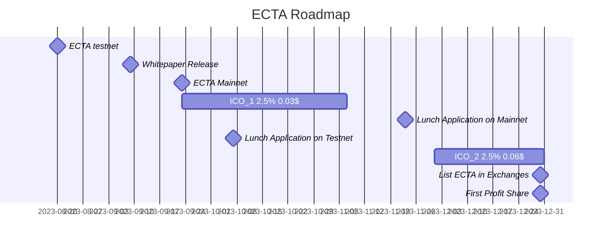

# ECTA Whitepaper

## Introduction

 Research shows that approximately 76% of retail investors who enter financial markets with limited knowledge incur losses. Therefore, there is an interest among investors to collaborate with professional traders and financial experts to experience profitable investments. However, distrust, lack of transparency, complex financial calculations, and numerous other issues exist in the interactions between investors and financial experts, creating concerns for both parties.

At EchoTrade, we have addressed these problems using blockchain technology, providing an open and transparent space for both sides. Investors can choose their financial experts with an informed perspective, while financial experts can engage in their activities without worries. To do this, all you need to do is connect your wallet and invest any desired amount in your preferred fund.

## Problem Statement

The crypto market is a highly volatile and complex environment that requires constant monitoring and analysis. Investors who want to profit from this market need to have access to reliable information, tools, and strategies to make informed decisions. However, not all investors have the time, skills, or resources to do so.

Traders who have the expertise and experience in the crypto market can offer their services to investors who need them. Traders can help investors by providing them with market insights, trading signals, portfolio management, risk management, and other valuable services. However, there are some challenges and risks involved in this process.
One of the main challenges is the lack of trust between investors and traders. Investors may not trust traders with their funds or their trading performance. Traders may not trust investors with their fees or their feedback. There is no guarantee that either party will fulfill their obligations or expectations.

Another challenge is the lack of liquidity and efficiency in the crypto market. Investors may not have enough funds available to invest in the best opportunities at the right time. Traders may not have enough funds accessible to execute their trades quickly and effectively. There may be delays, fees, or risks involved in transferring funds between different platforms or wallets.

These challenges create a gap between investors and traders that prevents them from collaborating and benefiting from each other’s skills and resources. This gap limits the potential growth and profitability of both parties and the crypto market as a whole.

## Solution Overview

EchoTrade is a platform that aims to bridge this gap between investors and traders by providing a comprehensive and interactive solution for crypto investing and trading.EchoTrade has developed an ecosystem that enables traders and investors to collaborate seamlessly, obviating the need for blind trust. Leveraging the power of blockchain technology, EchoTrade establishes a robust and transparent solution to rectify the challenges that have traditionally marred the relationship between traders and investors. The platform also serves as a reliable marketplace for investors seeking qualified traders, a selection process carefully vetted by EchoTrade's experienced financial team through a rigorous series of steps and interviews.

Investors are empowered to select their preferred baskets based on a range of parameters such as risk tolerance, ranking, experience, and strategy. This freedom allows them to invest their funds confidently, knowing they have control, and the ability to withdraw at their convenience.

EchoTrade is a platform where users can:

- Share their insights, opinions, and predictions with other users
- Create and join trading groups and pools to collaborate and pool resources
- Earn rewards for contributing with the platform by locking ECTA tokens.

EchoTrade leverages blockchain technology to enable trustless and instant transactions between investors and traders.
EchoTrade’s smart contracts ensure that both investors and traders are protected from fraud, default, or dispute. EchoTrade’s smart contracts also ensure that both investors and traders are rewarded for their participation and contribution. EchoTrade’s smart contracts automatically execute the following functions:

- Investing Funds to a particular Basket or pool created by Trader.
- Withdrawing Funds from a particular Basket or pool.
- Withdrawing Profits from a particular Basket or pool.
- Profit Sharing and deduction of profit to the Investors based on their funds.
- Loss the Base Fund of Investor in the case of loss on Exchange.
- Deduct fees or commissions from the profit gained to Platform and Trader according to predefined rates

Each Pool on EchoTrade has public attributes that define its functionality:

- **trader**: Address of the trader account with access to the ProfitShare function.
- **admin**: Main ECTA address; manages the admin share and can designate an assistant.
- **adminAssistant**: Allows verified individual investors to invest.
- **baseToken**: Accepted token for the liquidity pool, typically a stable token like USDT.
- **status**: Basket status; {0:pending, 1:active, 2:closed}
- **traderFund**: Trader's initial funds, which can't be withdrawn until the basket closes.
- **xid**: External identifier for system integration.
- **iteration**: Number of profit/loss instances.
- **duration**: Expected interval between two profit/loss occurrences.
- **startTime**: Timestamp indicating when trading with funds can commence.
- **endTime**: Final timestamp for investing in the basket.
- **minFund**: Minimum amount needed to unlock the basket for trading.
- **maxFund**: Basket's fund ceiling.
- **Fee Structure**: Details on trader and platform's shares from successful profits.
- **Liquidity Information**: Details about required, exchange-locked, and contract-locked liquidity.
- **Fund Management**: Overview of total locked, queued, and released funds.
- **Investor Details**: Info on profits, requested funds, locked funds, and profit share histories.

## Solution Details

In this section, we will explain in more detail how our platform works and what features and benefits it offers to our users. We will also describe how our platform interacts with four key players in the crypto space: investors, traders, crypto exchanges, and the managing company.

### Investors

Investors are users who want to invest in the crypto market but do not have the time, skills, or resources to do so effectively. Investors can use our platform to access a wide range of trading groups and pools that suit their needs and preferences. Investors can also use our platform to learn from experts and peers, share their insights and opinions, and earn rewards for supporting the platform.
To join our platform as an investor, a user needs to follow these steps:

- Choose an e-wallet and link it to our platform
- Go through the KYC process using our third-party KYC provider integrated in our platform
- Access the list of traders on our platform and choose which trader to invest with
- Join a trading pool based on the budget and duration
- Deposit funds into the trading pool
- Wait for the trader to open and close a position on a crypto exchange
- Receive profits or losses according to the predefined terms
- Withdraw funds from the trading pool.

As an investor, a user can enjoy several features and benefits on our platform, such as accessing to transparent information and analysis on their investments.

### Traders

Traders are users who have the expertise and experience in the crypto market and can offer their services to investors who need them. Traders can use our platform to access a large pool of funds that increase their capital and flexibility. Traders can also use our platform to showcase their skills and reputation, access a loyal customer base, and earn rewards for improving the platform.

To join our platform as a trader, a user needs to follow these steps:

- Choose an e-wallet and link it to our platform
- Go through the KYC process using our third-party KYC provider integrated in our platform
- Create a profile and upload their resume and records of trades
- Apply to create a trading pool based on their qualifications and niche
- Open and close a position on a crypto exchange

As a trader, a user can enjoy several features and benefits on our platform, such as:

- Access to a large pool of funds that increase their capital
- Access to a flexible fee structure that reflects their value
- Access to a loyal customer base that trusts their services
- Access to a competitive platform that showcases their skills
- Access to a secure and efficient trading environment using DEX integration
- Access to incentives and rewards for improving the platform

### Crypto Exchanges

Crypto exchanges are platforms that allow users to buy, sell, or trade cryptocurrencies. Crypto exchanges are essential for our platform as they provide diverse access to various Cryptocurrencies for our traders.

### Managing Company

The managing company is the entity that rules and manages the risks and defines the leverages and limits in the trades and deals on our platform. The managing company is responsible for ensuring the quality, safety, and fairness of our platform. The managing company performs several functions.

- Verify the identity and credentials of users who join or create trading groups or pools using our third-party KYC provider integrated in our platform
- Track the performance and activity of traders using various metrics, such as return on investment (ROI), win rate, drawdown, volatility, etc.
- Enforce rules and regulations on our platform, such as anti-money laundering (AML), counter-terrorism financing (CTF), etc.
- Monitor and mitigate risks on our platform, such as market risk, liquidity risk, operational risk, etc.

The managing company also sets some parameters and constraints for the trades and deals on our platform, such as:

- The maximum amount of funds that a trader can access from a trading pool
- The maximum leverage that a trader can use for a trade
- The maximum loss that a trader can incur for a trade
- Validating the profit share that a trader can offer to an investor

The managing company also sets some parameters and constraints for the trades and deals on our platform, such as:

- The maximum amount of funds that a trader can access from a trading pool
- The maximum leverage that a trader can use for a trade
- The maximum loss that a trader can incur for a trade
- Validating the profit share that a trader can offer to an investor

The managing company’s parameters and constraints are designed to protect both investors and traders from excessive losses or risks. For example:

- Each trader can only access 2% of each individual investor’s money in their basket. This means that if an investor transfers $10,000 of their money from their e-wallet to our platform, only 2% of that, $200, will be available to the trader to trade with. This limits the exposure and liability of both parties.
- The loss for each trade is capped at 15% of the liquidity of the basket. This means that if a trader opens a position with $200 from the trading pool, the maximum loss they can incur is $30. This prevents the trader from losing more than they can afford or wiping out the investor’s funds.

The managing company’s parameters and constraints are also designed to encourage both investors and traders to participate and contribute to our platform. For example:
The profit share for each trade is determined by the trader before opening a position. This means that the trader can offer a higher or lower percentage of their profits to the investor depending on their confidence or strategy. This gives the investor the option to choose the best deal for them.
The managing company’s parameters and constraints are also designed to balance both centralization and decentralization on our platform. For example: The KYC process for both investors and traders is centralized using our third-party KYC provider integrated in our platform.

## Tokenomics

In this section, we will explain the economics and mechanics of our platform’s native token, ECTA. We will also describe how our token sale works and how we plan to use the funds raised from it.

### ECTA Token

ECTA is an TRC-20 token that runs on the Tron Network. TRC-20 is a token standard that defines a set of rules and functions for creating and managing tokens on Ethereum. TRC-20 tokens are compatible with various wallets, exchanges, and DApps that support Tron.

Total Token Supply : 100,000,000

Token Digits : 6

### Token Distribution

The initial distribution of ECTA tokens includes various stakeholders such as initial investors, the team, and the company itself. The tokens allocated to these parties will be subject to vesting schedules to promote long-term commitment and alignment with the project's goals.

The distribution of ECTA tokens is divided among different entities as follows:

| Type                            | Share | Cliff    | Vesting   |
| ------------------------------- | ----- | -------- | --------- |
| Strategic Investors and Advisor | 25%   | 6 month  | 2 years   |
| Foundation                       | 20%   | 6 month  | 2 years   |
| Team                            | 12%   | \-       | 2.5 years |
| Liquidity                       | 18%   | \-       | \-        |
| Treasury                        | 15%   | \-       | 2 years   |
| Strategic reserved              | 10%   | 6 months | 2 years   |

#### Entities

##### Strategic Investors

Strategic Investors play a crucial role in seeding the project from its early stages to the final phase. The accounts of investors will be locked for liquidity management purposes. The unlocking process will commence after 6 months from the token release, and it will take two years to fully unlock the invested funds. This logic is integrated into the main ECTA contract.

##### Foundation

EchoTrade operates as a hybrid platform, combining both centralized and decentralized elements. The Foundation provides the necessary requirements and infrastructure for the platform to be profitable and valuable. The main source of income for the Foundation comes from holding the ECTA token and participating in the Fair Profit Sharing System implemented in the Basket and ECTA contracts.

The current candidate representing the Foundation is IRIS DIGITAL VENTURES LTD, based in London, UK. Detailed insights into the company's strategies for platform profitability can be found on the company's website and blogs.

##### Team

A skilled and experienced team is vital for the success of EchoTrade. This share is allocated to attract and onboard experts who will collaborate with EchoTrade to enhance the platform's value, profitability, and sustainability. The team consists of several major groups:

- Tech Team (Development and DevOps)
- Marketing Team
- Legal Team
- Financial Team
- Advisors Team
- Support and Office Team

##### Liquidity

Liquidity plays a pivotal role in actively managing and regulating the market price of the ECTA token. The custody of these liquidity reserves is vested in a multi-signature account, which is overseen collectively by the Board of Directors, CEO, CTO, Exclusive Advisors, and Initial Investors.
The returns yielded from the liquidity pool can be strategically reinvested in the acquisition of ECTA tokens, thereby augmenting the overall liquidity pool.This comprehensive liquidity management plan encompasses various stages, including the Initial Coin Offering (ICO), Initial DEX Offering (IDO), Public and Private Sale, Exchange Listing, and Token Offering.

##### Treasury

The Treasury allocation within EchoTrade's token distribution represents a reserved portion of ECTA tokens set aside to address unexpected financial needs or opportunities that may arise during the platform's operations. This reserve functions as a multi-signature account, with decision-making authority shared among key stakeholders including the Board of Directors, CEO, CTO, Exclusive Advisors, and Initial Investors. This approach ensures collaborative decision-making and allows EchoTrade to navigate unforeseen situations without disrupting its operations, promoting transparency and responsible resource management.

By designating ECTA tokens to the Treasury, EchoTrade demonstrates its commitment to maintaining a stable and adaptable operational environment. This strategic reserve enables the platform to swiftly respond to unforeseen challenges or capitalize on time-sensitive opportunities, ultimately contributing to the long-term sustainability and resilience of the EchoTrade ecosystem.

##### Strategic reserved

The Strategic Reserve is securely stored in a multi-signature account, overseen collectively by the Board of Directors, CEO, CTO, Exclusive Advisors, and Initial Investors. Its primary usage encompasses responding to emergencies, fostering community expansion, and ensuring market stability.

### Evolution of ECTA Over Time

As EchoTrade continues its growth trajectory and generates profits, various beneficiaries, including the Strategic reserved and Treasury accounts and token holders, will reap the benefits. Additionally, the release of tokens across different accounts, such as the Team and Investors, will transpire gradually over time. To bolster market stability in the face of these token releases, the profits from Strategic reserved and Treasury management will be harnessed to strategically generate demand. This demand management mechanism will counteract potential impacts on the ECTA token's market value. Consequently, a progressive accumulation of tokens within the Strategic reserved and Treasury accounts is projected over time. However, when the ECTA balance reaches a certain threshold, Strategic reserved or Treasury may initiate token burns to curb overexpansion.

### Utility

The ECTA token serves as major utility alongside of other stable token like USDT, within the EchoTrade ecosystem. it is used to Locking to having some share of profits gained by the platform.

#### Basket Trading and Profit Sharing

EchoTrade offers a platform where Basket creators can manage and trade with the funds invested in their Baskets. When profitable trading occurs, the gained profit from the market is shared among the Trader (Basket creator), the Investor, and the ECTA token lockers.

The ECTA token plays a pivotal role in distributing the profits gained from the trading of Baskets. These profits are proportionally shared with ECTA token holders based on their ECTA token locked balance. Holders with larger ECTA balances receive a higher share of the distributed profits, aligning rewards with the level of token ownership.

### Token Burning and Locking

Locking and burning ECTA tokens will control the liquidity and price of the token in market. in burning, under certain conditions, a portion of ECTA tokens can be permanently removed from circulation. Additionally, considering the emphasis on long-term engagement, the locking mechanism introduced to encourage holders to lock up their tokens for a specific period in exchange for rewards and benefits.

### Alignment With Project Goals

The ECTA tokenomics aims to incentivize participation, investment, and engagement within the EchoTrade ecosystem. By rewarding both traders and investors with a share of the profits gained from successful trading activities, the token promotes collaboration and growth. The distribution of profits to token holders aligns incentives and encourages the accumulation of ECTA tokens, fostering a community of stakeholders with a shared interest in the platform's success.

### Market

The total cryptocurrency market cap stands at an impressive $1,063,343M. Notably, as ECTA's foundation is established within the Tron Network, the total market cap of Tron approximates $6,797M. With a targeted $200M capitalization from this market, our ambition aligns with leveraging ECTA's unique value proposition. This approach enables us to envision a substantial contribution to the Tron network, fueling its growth and dynamics.

The Tron Network boasts an extensive user base, encompassing around 180M active accounts. Operating on a rapid 3-second block time and transaction fees ranging from $1.4 to $2, Tron's technical characteristics make it an apt choice for our roadmap's next two years. This strategic alignment underpins our mission as we prepare for the launch of our independent network.

### Financial Estimation

Drawing from our comprehensive studies and meticulous research, our growth projections for both investors and ECTA's revenue are outlined below. For detailed numerical insights, please refer to [this link](https://docs.google.com/spreadsheets/d/17e_JzyNjLAhmHyg95optmKidv2ySa8w-kPGbMrYCFFw/edit?usp=sharing).

Based on our average estimations, ECTA anticipates achieving an overall monthly revenue of approximately $400K. With a total token supply of 100M, this implies that if all tokens are locked, each token is expected to yield around 0.4 cents per month and 4.8 cents per year. This projected earning contributes to our initial token pricing strategy, set at 5 cents. In our ICO#1, we have chosen a conservative launch price of 3 cents, alongside a targeted volume of 2.5M tokens. In an optimistic scenario, after two years post-launch, each token could potentially generate a yearly return of 14.4 cents.

These projections reflect our deep understanding of market dynamics and our commitment to building a sustainable and rewarding ecosystem for both our investors and the ECTA platform itself.

## Technical Overview

### HLD

### Critical Flows

#### Create Basket

1. Traders request EchoTrade to create a Basket.
2. EchoTrade deploys a new Basket on the network and designates the ECTA address as the Administrator.
3. EchoTrade then calls the ECTA to add the new Basket by address.
4. The ECTA checks the superadmin address, and if it matches, it approves the new Basket.

#### Investing in the Basket

1. An investor requests permission from EchoTrade, providing the amount and desired Basket. EchoTrade verifies the investor's eligibility and returns a signature to the investor.
2. The investor approves the amount from the base contract (usually USDT) to the Basket's address.
3. The investor calls the Basket contract with the amount and signature.
4. The Basket validates whether the signature comes from the Basket Administrator or its assistant.
5. The Basket transfers the amount from the investor's account to itself, updating its state. The invested funds are queued to be locked during the next profit sharing event. These funds are also instantly withdrawable if the investor changes their mind.

#### Basket Profit Sharing

##### With Profit

1. After the trader achieves profit through trading, they request a profit sharing event.
2. EchoTrade validates the profit amount and creates a signature to trigger the profit sharing function.
3. A history of trading activities, including positions and orders, is deployed on IPFS, and its CID is recorded.
4. The trader or EchoTrade calls the ProfitShare function of the Basket Contract.
5. The Basket validates the signature and data. Based on constant properties like trader success fee and admin success fee, the respective accounts are credited with their share of the profit. The investors' profits are distributed according to their locked amounts during the current iteration.
6. The Basket locks the queued funds awaiting participation in the profit sharing.
7. The Basket releases requested funds from the locked amount for investors who wish to withdraw their main funds.

##### With Loss

1. If the trader experiences losses through trading, they request a Lost Fund event.
2. EchoTrade validates the lost amount and creates a signature to trigger the lost amount function.
3. Similar to profit sharing, a history of trading activities is deployed on IPFS with its CID.
4. The trader or EchoTrade calls the ProfitShare function of the Basket Contract with a negative value.
5. The Basket validates the signature and data, then reduces the base funds of each investor based on their share of locked funds.
6. The Basket locks the queued funds awaiting participation in processing.
7. The Basket releases requested funds from the locked amount for investors who want to withdraw their main funds.

#### ECTA Profit sharing

1. When the Baskets accumulate profits, they use their constant properties to deduct a portion of the gained profit from the SuperAdmin account, which corresponds to the ECTA address.
2. ECTA gathers profits from each Basket and allocates them among ECTA holders who have locked their tokens.
3. Each holder's share of the profits can be withdrawn at any time, providing them with the flexibility to access their earnings.

#### Withdraw

##### Withdraw Profit

- Investors' profits are always withdrawable at any time, as they are distributed through the profit sharing process.

##### Withdraw Fund

1. An investor requests the Basket Contract to release their locked funds, either fully or partially.
2. The released funds become available during the next profit sharing event.
   - If the next profit sharing call results in a negative value (loss of base funds), it impacts the requested amount. For example, if you have 100 units locked as funds and request the release of 50 units, and the profit sharing results in a negative value, your share could become -20 units in total. In this case, you will have 40 units released and 40 units remaining locked in the Basket.

> Both queued funds and released funds can be withdrawn at any time.

## Roadmap

### Lunching Roadmap

### Task Checklist

- [ ] ECTA on Nile testnet
- [ ] Release Whitepaper
- [ ] ECTA on mainnet
- [ ] Start ICO_1: 2.5M tokens at 3&cent; for 45 days
- [ ] Launch Platform on Nile testnet
- [ ] Start ICO_2: 1M tokens at 6&cent;
- [ ] List ECTA on exchanges: SunSwap, P2B, BitGet, dydx
- [ ] First Profit Sharing

### Feature Roadmap

#### ✅ MVP Product

Our primary goal is to launch the MVP and establish a sustainable ecosystem for continuous growth and development. This goal has been meticulously planned and is set to be achieved by the end of 2023.

#### 🕸️ ECTA Network

Our vision is to expand our Profit Share Strategy and provide greater transparency in order and position details, enabled by blockchain technology.

#### 🚀 Develop Stable Coins { USD, EUR, GBP, ...}

We aim to diversify the stable coins available on our platform, allowing baskets to be created based on various global currencies. This approach reduces reliance on a single currency.

#### 📈 Develop Forex Market

Our plan includes offering traders the opportunity to participate in Forex markets. This expansion will open doors to a larger market capacity and increased depth.

#### 🤖 AI-Powered Trader Assistant

As our profits are linked to the system's overall performance, we are committed to introducing advanced technological solutions to assist traders in achieving more profitable trading strategies.

### Vision

In alignment with the EchoTrade roadmap, our vision revolves around the development of a comprehensive ecosystem that drives collaboration, innovation, and empowerment among traders and investors. As we embark on this journey, our initial focus is on launching the MVP product, a crucial milestone that lays the foundation for sustained growth. By the end of 2023, we envision a thriving ecosystem where traders and investors can seamlessly connect, breaking down barriers and fostering trust.

A pivotal component of our vision is the ECTA Network, an innovative solution powered by blockchain technology. Through this network, we are poised to revolutionize profit sharing, providing traders and investors with unprecedented transparency into order and position details. By doing so, we aim to enhance trust and reliability within our ecosystem, ensuring that collaboration flourishes on a foundation of clear information and accountability.

Our forward-looking approach extends to diversifying the stable coins available on our platform. This strategic move will enable the creation of baskets based on a variety of global currencies, mitigating reliance on a single currency. Simultaneously, our expansion into the Forex market opens doors to broader market capacity and greater depth, enabling traders to explore new avenues for growth and diversification.

Powered by cutting-edge technology, including an AI-Powered Trader Assistant, our vision embraces continuous innovation. Our commitment to introducing advanced tools ensures that traders have the support they need to navigate the complexities of the market and optimize their strategies. This dedication to technological advancement underscores our overarching goal of providing an environment where traders and investors can thrive, building a future where financial collaboration is seamless, transparent, and mutually beneficial.
